

  

<h1 align="center">
  
</h1>

<b>Plataforma de Gestión de Esports e Informes en Java | Universidad de Sonora</b>

 

<b>Creadores y Modalidad</b>

* **Integrantes:** Natalia Valenzuela ([@NataliaVlza](https://github.com/NataliaVlza)) y equipo de trabajo
* **Institución:** Universidad de Sonora (UNISON) - Facultad Interdisciplinaria de Ingenierías
* **Modalidad:** Proyecto guiado y desarrollado en sesiones prácticas de laboratorio.
* **Contacto:** natalia.sanchezvlza@gmail.com
* **Ubicación:** Hermosillo, Sonora, México

 

<b>Descripción del Proyecto</b>

Aplicación de escritorio en Java para el control integral de torneística y ligas de esports. La plataforma centraliza la administración de videojuegos, ligas activas, equipos, jugadores inscritos, calendario de encuentros, tablas de clasificación y la generación de reportes e informes dinámicos en formato PDF.

<b>Funcionalidades y Requisitos Implementados:</b>

* **Gestión de Ligas y Videojuegos:** Registro, edición y consulta parametrizada de títulos y torneos organizados.
* **Administración de Equipos y Roster:** Alta de jugadores y asignación dinámica a sus respectivos equipos dentro de la liga.
* **Encuentros y Clasificaciones:** Registro de resultados de partidas con actualización en tiempo real de la tabla general de posiciones.
* **Reportes e Informes (JasperReports):** Módulo especializado para la exportación e impresión de reportes y estadísticas en PDF.

 

<b>Imágenes del Proyecto</b>

<b>1. Pantalla de Inicio</b> 
Panel principal de navegación e interfaz general del sistema.

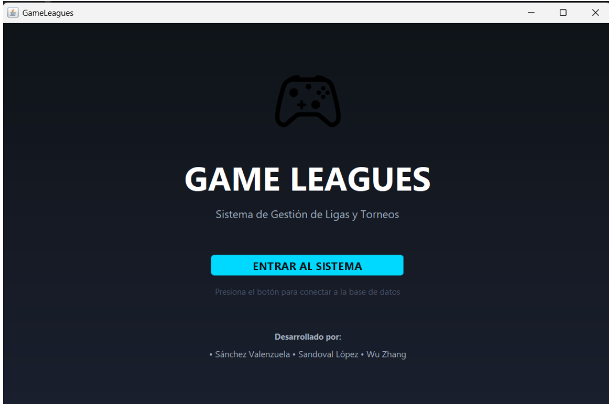

 

<b>2. Pestaña de Videojuegos</b> 
Catálogo y gestión de los títulos competitivos integrados en la plataforma.

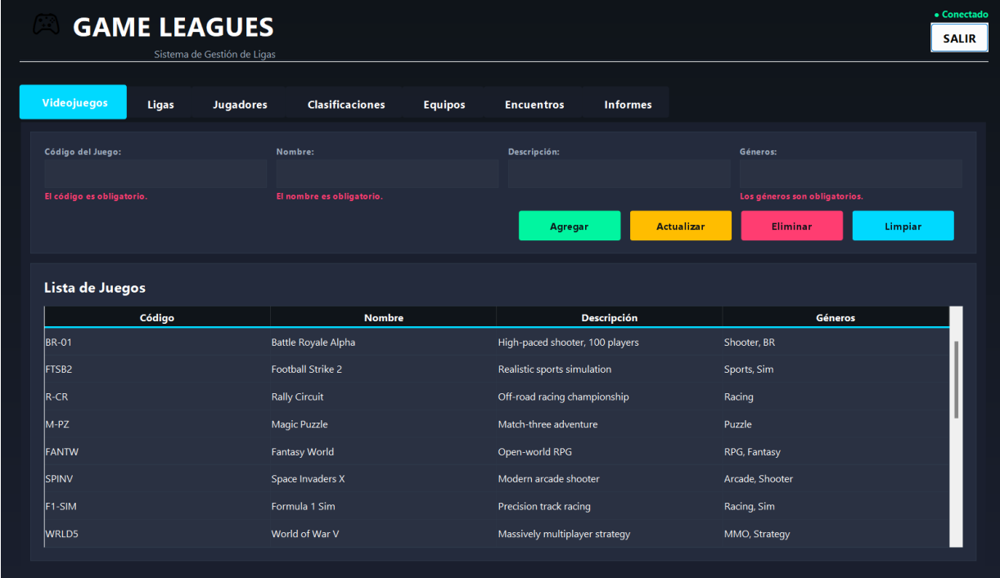

 

<b>3. Pestaña de Ligas</b> 
Administración de las ligas y torneos activos registrados en la base de datos.

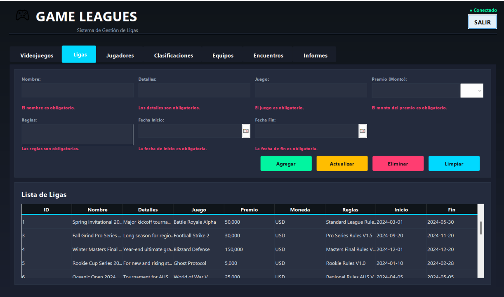

 

<b>4. Pestaña de Equipos</b> 
Módulo de control para el registro y consulta de equipos participantes.

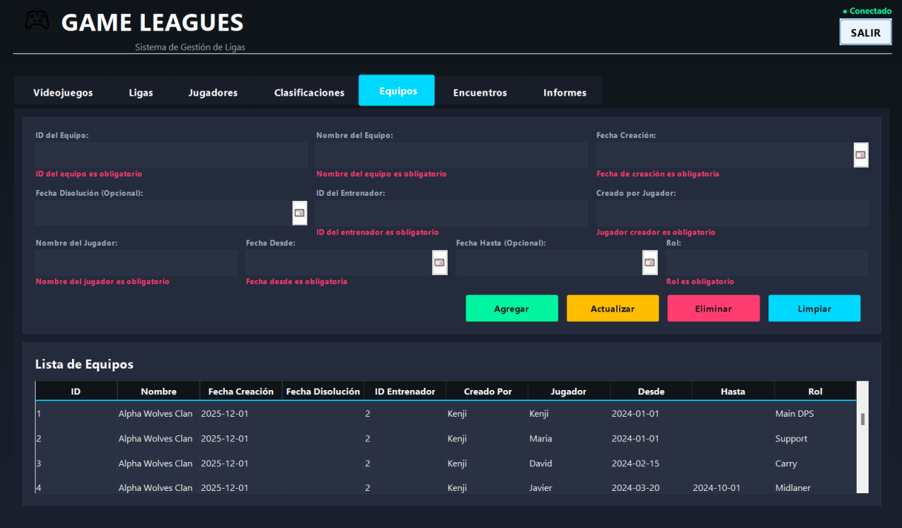

 

<b>5. Pestaña de Jugadores</b> 
Gestión de competidores, sus perfiles e integración en los distintos equipos.

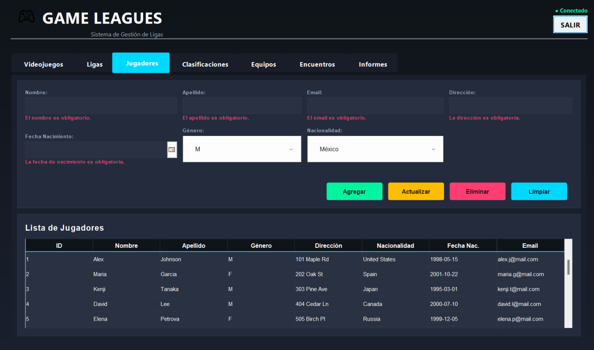

 

<b>6. Pestaña de Encuentros</b> 
Programación y captura de resultados de los partidos entre equipos.

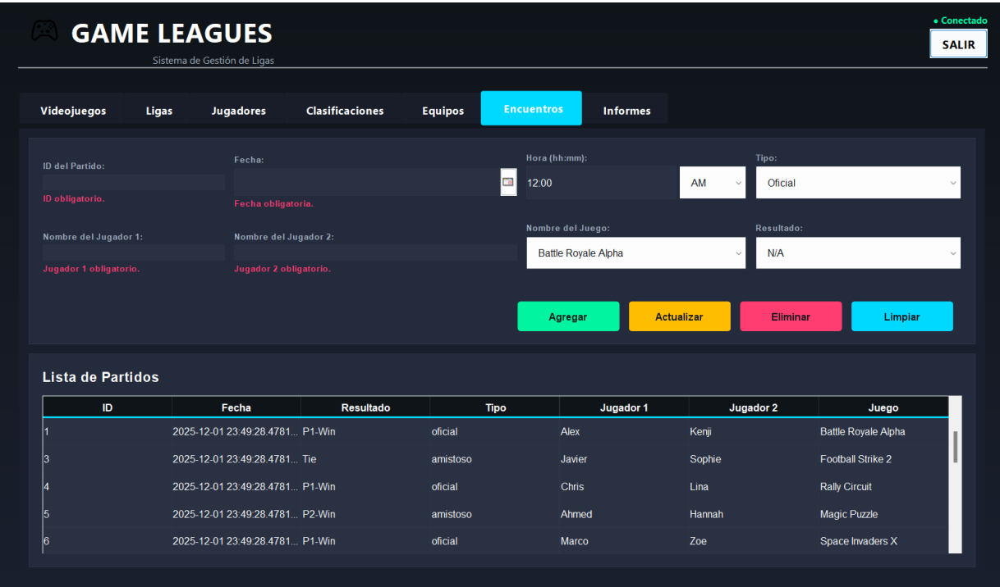

 

<b>7. Pestaña de Clasificaciones</b> 
Tabla de posiciones calculada automáticamente según los marcadores de los encuentros.

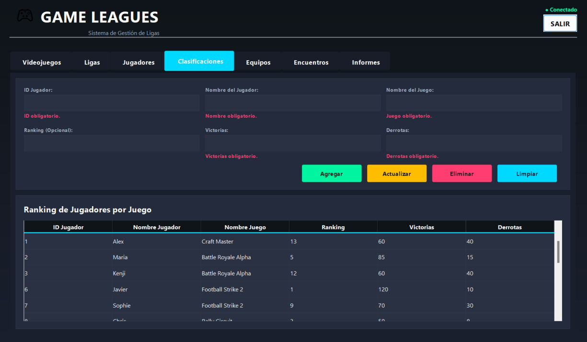

 

<b>8. Pestaña de Informes</b> 
Sección dedicada a la selección y parametrización de reportes institucionales.

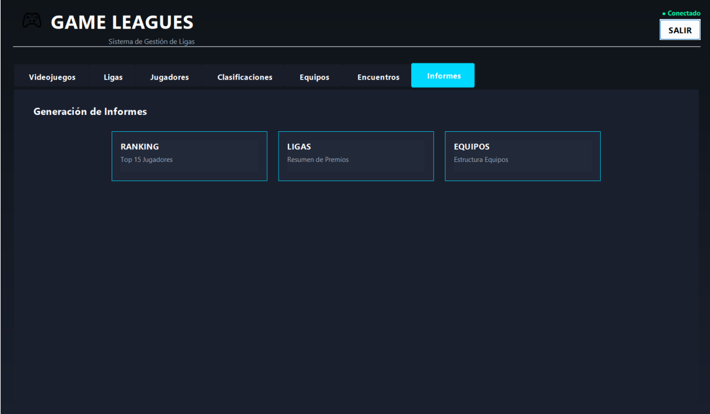

 

<b>9. Reportes Generados en PDF</b> 
Vista previa de los informes impresos exportados con plantillas personalizadas.

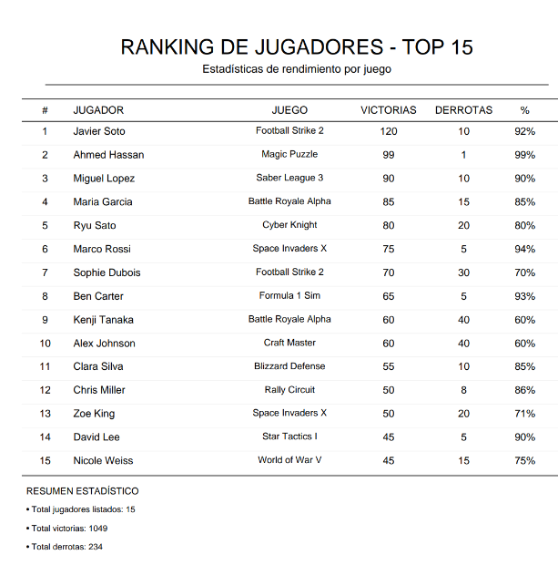

 

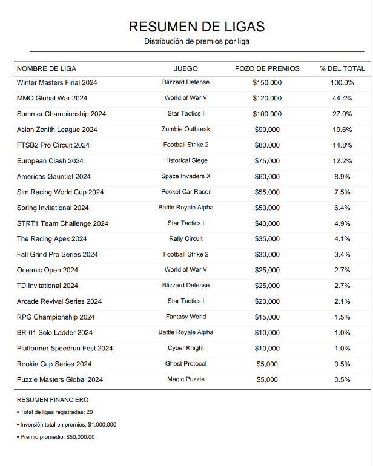

 

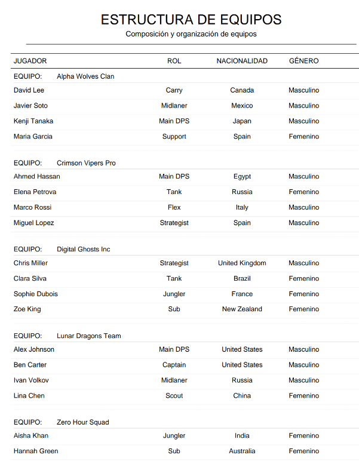

 

Créditos de componentes visuales: <a href="https://github.com/kyechan99/capsule-render/blob/main/docs/README_es.md">capsule-render</a> por @kyechan99 y <a href="https://github.com/denvercoder1">readme-typing-svg</a> por @DenverCoder1

  

